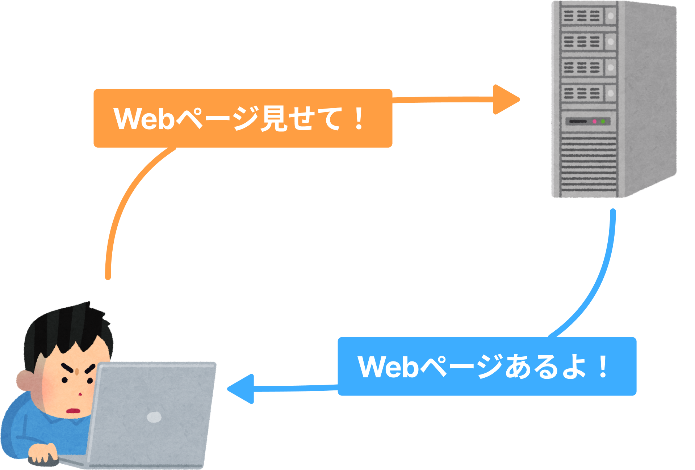
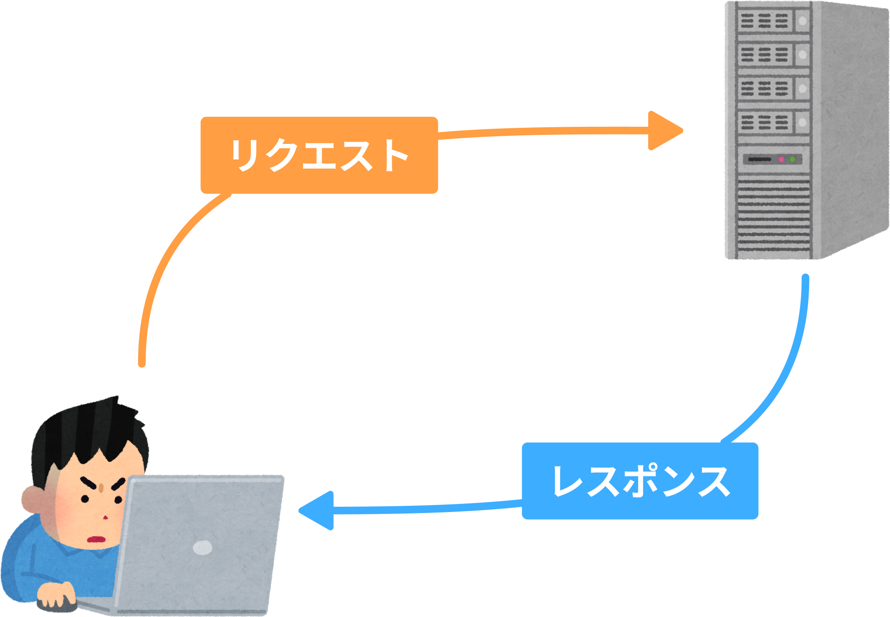
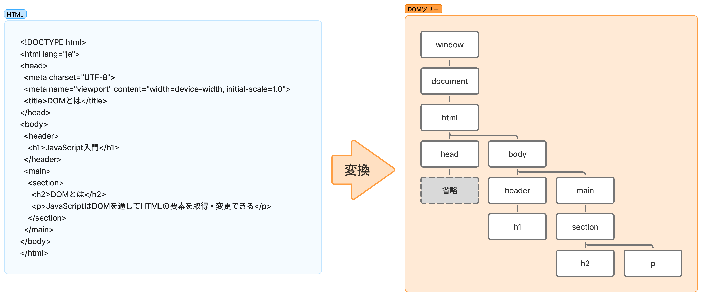

<!-- _class: cover
_paginate: false -->

# JavaScript 超入門

<p class="subtitle">WebデザイナーのためのJavaScript入門講座</p>

<div class="meta">
作成日：2026年8月<br>
作成者：福本 佑介
</div>

---

<!-- _class: section
_paginate: false -->

# JavaScriptとは

---

<!-- _header: "「プログラム」とは" -->

<div class="contents lead">

<p><em>「プログラム」</em>と聞いて思い浮かべるものは？</p>

</div>

---

<!-- _header: "「プログラム」とは" -->

<div class="contents">

- 運動会や演奏会の「プログラム」＝進行の手順表
- あらかじめ決めた手順を、1から順に実施していくもの

> 古代ギリシャ語が由来と言われている。「pro（前もって）」+「gramma（書かれたもの）」

</div>

---

<!-- _header: "コンピュータプログラムとは" -->

<div class="contents">

- コンピュータへの指示（命令）が書かれたもの
- 決められた順番どおりに実行される
- アプリやシステムを作る以外に、業務の自動化、データ解析等に用いられる

</div>

---

<!-- _header: "様々なプログラミング言語" -->

<div class="contents">

- 世の中にはPython・Java・Ruby・PHP・C言語など、多くの言語がある
- 言語ごとに得意な分野・動作環境が異なる
- 制作するモノ・環境に合わせて使用する言語を選定する

</div>

---

<!-- _header: "Webの仕組み（復習）" -->

<div class="contents">



</div>

---

<!-- _header: "Webの仕組み（復習）" -->

<div class="contents">



</div>

---

<!-- _header: "リクエストからレンダリングまでの流れ" -->

<div class="contents">

1. ブラウザはURLをリクエストし、サーバーからHTMLを受け取る
2. HTML中の<code>&lt;link&gt;</code>や<code>&lt;script&gt;</code>を見つけ、CSS・JSを追加でリクエストする
3. HTMLを解析し、構造(骨組み)を組み立てる
4. 構造化されたHTMLにCSSで装飾する
5. JavaScriptで実装した処理を加える

</div>

---

<!-- _header: "JavaScriptの特徴" -->

<div class="contents">

- HTMLは構造、CSSは見た目を担当
- JavaScriptは **「動き」** を担当
- ブラウザの中で動くプログラム
- HTMLやCSSをレンダリング後に書き換えることができる
- クリックやスクロールなど、ユーザーの操作に反応する

</div>

---

<!-- _header: "scriptタグの読み込み" -->

<div class="contents">

```html
<script src="js/main.js"></script>
```

- `</body>` の直前に置くことが多い
- 読み込んだJSファイルがブラウザで実行される

</div>

---

<!-- _header: "はじめてのconsole.log()" -->

<div class="contents">

```js
console.log('Hello, JavaScript!');
```

コンソールに文字を表示する、最初の一歩。

</div>

---

<!-- _class: section
_paginate: false -->

# 要素(DOM)の操作

---

<!-- _header: "DOMとは" -->

<div class="contents">

- ブラウザはHTMLを読み込むと、木構造のオブジェクトとして扱えるようにする
- この仕組みを**DOM**（Document Object Model）という
- JavaScriptはDOMを通してHTMLの要素を取得・変更できる

> オブジェクト（Object）… 関連するデータをひとまとめにしたもの

</div>

---

<!-- _header: "DOMとは" -->

<div class="contents">



</div>

---

<!-- _header: "DOMを操作する手順" -->

<div class="contents">

DOM操作の基本は3ステップ。

1. **取得**：操作したい要素をつかまえる
2. **確認**：今の状態（プロパティ）を読む
3. **書き換え**：値を書き換えて見た目や内容を変える

</div>

---

<!-- _header: "DOMの取得 `querySelector()`" -->

<div class="contents">

```js
document.querySelector('#btn');
```

- CSSセレクタと同じ書き方（`#id`・`.class`など）で要素を探す
- 条件に一致する最初の1つを取得する
- 取得した要素に対して、続けて操作を行う

</div>

---

<!-- _header: "プロパティの確認と書き換え" -->

<div class="contents">

```js
document.querySelector('#photo').src = './images/photo-b.svg';
```

- `innerText`：表示文字を書き換える
- `src` / `alt`：画像とその説明を差し替える
- `href`：リンク先を書き換える

</div>

---

<!-- _header: "イベントとは" -->

<div class="contents">

- クリックやスクロール、ページの読み込みなど、ブラウザで起きる出来事を**イベント**という
- ブラウザはイベントの発生をリアルタイムに検知している
- JavaScriptは「イベントが起きたら実行する処理」を仕込める

</div>

---

<!-- _header: "イベントの型 `addEventListener()`" -->

<div class="contents">

```js
document.querySelector('#btn').addEventListener('click', () => {
  // クリックされたときの処理
});
```

- `addEventListener()`で「クリックされたら実行する処理」を登録する
- イベント操作は「取得 → クリックを待つ → 処理」が**基本の型**

</div>

---

<!-- _header: "class属性の操作" -->

<div class="contents">

- HTML要素の`class`属性を書き換えると、CSSで用意した見た目に切り替えられる
- 文字列を直接書き換えるのではなく、`classList`という専用の方法を使う
- 追加・削除・切り替えのための手段が用意されている

</div>

---

<!-- _header: "classListの操作" -->

<div class="contents">

```js
document.querySelector('.box').classList.toggle('is-active');
```

- `add()`：クラスを付ける
- `remove()`：クラスを外す
- `toggle()`：付いていれば外す、なければ付ける

</div>

---

<!-- _header: "ドロワーのHTML/CSS確認" -->

<div class="contents">

- ハンバーガーボタン（`#btn-nav`）とナビゲーション（`.g-nav`）がある
- `body`のclass属性に`is-open`が付くと、CSSでメニューが開いた見た目になる
- JSの役割は`is-open`の付け外しだけ

`index.html`の`body`要素に`is-open`を手入力して動作を確認しよう。

</div>

---

<!-- _header: "drawer.jsを書き始める" -->

<div class="contents">

これまでの型のおさらい。

1. **取得**：ボタンと`body`を`querySelector()`で取得する
2. **クリック**：`addEventListener('click', ...)`でクリックを待つ
3. **class**：クリックされたら`classList.toggle('is-open')`

</div>

---

<!-- _header: "ドロワー実装（個人ワーク）" -->

<div class="contents lead">

<p>ここまでの型を組み合わせて<code>drawer.js</code>を完成させよう</p>

</div>

---

<!-- _header: "DOMの操作のまとめ" -->

<div class="contents">

- **取得**：`querySelector()`で要素をつかまえる
- **イベント登録**：`addEventListener()`でクリックを待つ
- **書き換え**：`classList`やプロパティで見た目・内容を変える
- この型は、次のモーダルでもそのまま使う

</div>

---

<!--
 _class: section
_paginate: false
 -->

# モーダル

---

<!-- _header: "DOMの操作の振り返り" -->

<div class="contents">

ここまでのおさらい

1. **取得**：`querySelector()`で要素をつかまえる
2. **クリック**：`addEventListener()`でクリックを待つ
3. **書き換え**：プロパティや`classList`で見た目を変える

モーダルも、この型の組み合わせでできる。

</div>

---

<!-- _header: "モーダルとは" -->

<div class="contents">

- 画面の手前に重なって表示される、小さいウィンドウ
- 表示されている間は、背景（元のページ）を操作できない
- 確認メッセージや画像の拡大表示などによく使われる

</div>

---

<!-- _header: "`<dialog>`とは" -->

<div class="contents">

- ダイアログ（ポップアップ）を表示するためのHTML要素
- `open`属性が付くと表示、外れると非表示になる
- `showModal()`で開く（`open`属性が自動で付く）とモーダルとして動作する（今回はこちらを使う）
- ポートフォリオでは、Worksカードの画像拡大に使う

</div>

---

<!-- _header: "モーダルの開閉" -->

<div class="contents">

```js
document.querySelector('#sample-dialog').showModal();
document.querySelector('#sample-dialog').close();
```

- `showModal()`：モーダルとして表示する
- `close()`：閉じる

</div>

---

<!-- _header: "変数（`const`）" -->

<div class="contents">

```js
const dialog = document.querySelector('#sample-dialog');
```

- `querySelector()`の結果を`const 名前 = ...`という形で保存できる
- 名前をつけておくと、同じ要素に何度もアクセスするときに使い回せる
- モーダルでは`dialog`・画像など複数の要素を扱うため、ここから使う

> ※変数には要素以外にも様々なデータを一時的に保存可能

</div>

---

<!-- _header: "`img` 要素の属性値をコピー" -->

<div class="contents">

```js
dialogImg.src = cardImg.src;
dialogImg.alt = cardImg.alt;
```

- クリックされたカードの画像の`src`・`alt`を、dialog内の`img`にコピーする
- 「画像の住所（URL）をコピーする」イメージ

</div>

---

<!-- _header: "モーダル実装（1カード）" -->

<div class="contents">

`dialog`・`dialogImg`・カード画像`cardImg`を事前に取得しておく。

```js
cardImg.addEventListener('click', () => {
  dialogImg.src = cardImg.src;
  dialogImg.alt = cardImg.alt;
  dialog.showModal();
});
```

</div>

---

<!-- _header: "閉じるボタンの実装" -->

<div class="contents">

```js
closeBtn.addEventListener('click', () => {
  dialog.close();
});
```

- 閉じるボタンがクリックされたら`close()`を呼ぶ
- ここまでで「開く」「閉じる」が揃う

</div>

---

<!-- _header: "モーダルのまとめ" -->

<div class="contents">

- **取得**：`dialog`・画像要素を`querySelector()`でつかまえる
- **クリック**：カード画像のクリックを待つ
- **画像コピー**：`src`・`alt`をdialogの画像にコピーする
- **表示**：`showModal()`で開き、`close()`で閉じる

</div>

---

<!-- _class: section
_paginate: false -->

# Works全カード分のモーダル実装

---

<!-- _header: "`querySelectorAll()`とは" -->

<div class="contents">

```js
document.querySelectorAll('.works-card__img > img');
```

- 条件に一致する要素を、`querySelector()`は最初の1つだけ、`querySelectorAll()`は**すべて**取得する
- 取得した結果は、要素が複数まとまった「リスト」になる
- リストの中の1つ1つに同じ処理をしたいときに使う

</div>

---

<!-- _header: "`forEach()`とは" -->

<div class="contents">

```js
items.forEach((item) => {
  console.log(item);
});
```

- リストの中の要素を、1つずつ順番に取り出して同じ処理を繰り返す
- `item`には、今処理している要素が1つずつ入る（名前は自由に付けられる）
- 「取得(All) → `forEach`で繰り返す → 中身はこれまでと同じ処理」という型

</div>

---

<!-- _header: "Works全カード対応の実装" -->

<div class="contents">

```js
worksImages.forEach((image) => {
  image.addEventListener('click', () => {
    dialogImg.src = image.src;
    dialogImg.alt = image.alt;
    dialog.showModal();
  });
});
```

- `forEach()`の中に、1カード版で書いた処理をそのまま入れる
- `image`は、今処理している1枚の画像を指す

</div>

---

<!-- _class: section
_paginate: false -->

# ライブラリ

---

<!-- _header: "ライブラリとは" -->

<div class="contents">

```html
<script src="https://cdn.jsdelivr.net/npm/swiper/swiper-bundle.min.js"></script>
```

- ライブラリ：誰かが作った「よく使う機能」をまとめたプログラム
- CDN（配信サーバー）から`<script>`で読み込むだけで使える
- カルーセル（スライドショー）には**Swiper**というライブラリを使う
- ライブラリはマニュアル（説明書）があるので、それに従う

</div>

---

<!-- _header: "Swiperの初期化" -->

<div class="contents">

```js
const swiper = new Swiper('.swiper', {
  loop: true,
});
```

- `new Swiper('.swiper', {...})`でカルーセルを初期化する
- `{ }`の中はオプション（設定）。`loop: true`で無限ループなど
- 難しい処理は自分で書かず、公式のサンプルを使い回すのが基本

</div>

---

<!-- _header: "jQueryの紹介" -->

<div class="contents">

```js
$('#btn-nav').on('click', function () {
  // クリックされたときの処理
});
```

- 昔からよく使われてきたJavaScriptの書き方（ライブラリの一種）
- バニラJSの`addEventListener()`と役割は似ている
- 今回の課題では使わない。紹介のみ

</div>

---

<!-- _class: section
_paginate: false -->

# 総仕上げ

---

<!-- _header: "総合仕上げ・カスタマイズ" -->

<div class="contents lead">

<p>テキスト・画像・配色を、自分のポートフォリオに合わせてカスタマイズしよう</p>

</div>

---

<!-- _header: "（おまけ）カスタムプロパティ" -->

<div class="contents">

```css
:root {
  --main-color: #005fb8;
}
.title {
  color: var(--main-color);
}
```

- CSSにも「変数」に近い仕組み（カスタムプロパティ）がある
- `--名前: 値;`で定義し、`var(--名前)`で呼び出す
- 配色などをまとめて管理・変更しやすくなる

</div>

---

<!-- _header: "（おまけ）CSSのネスト" -->

<div class="contents">

<div class="row">

```css
/* 通常 */
.works-card__meta {
  font-size: var(--font-size-sm);
}
.works-card__meta ul {
  display: flex;
}
.works-card__meta ul li {
  line-height: 1.8;
}
```

```css
/* ネスト */
.works-card__meta {
  font-size: var(--font-size-sm);
  ul {
    display: flex;
    li {
      line-height: 1.8;
    }
  }
}
```

</div>
</div>

---

<!-- _header: "（おまけ）CSSのネスト" -->

<div class="contents">

- CSSも要素の親子関係に合わせて入れ子（ネスト）で書ける
- 親セレクタを繰り返し書かずに済む
- `&`は親セレクタ自身を指す

</div>

---

<!-- _header: "総まとめ" -->

<div class="contents">

- **ドロワー**：取得 → クリック → `classList`
- **モーダル**：取得 → クリック → 画像コピー → 表示
- `forEach`・Swiperで、複数要素やライブラリにも対応できた
- 「取得 → イベント → 書き換え」という型は、どんな画面にも応用できる

</div>
